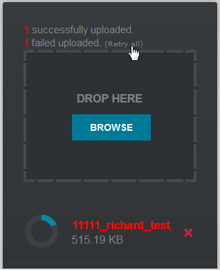
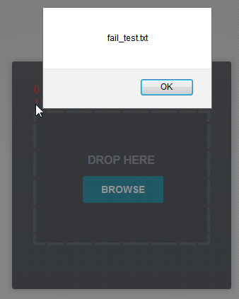

Mini-AJAX-File-Upload-Form
==========================

Modification for "Mini AJAX File Upload Form". This JQuery script allow visitors upload files from their browsers with drag/drop or by selecting them individually.

A brief usage tutorial can be found here: http://tutorialzine.com/2013/05/mini-ajax-file-upload-form/

The script is great, fancy and easy to use. However, it only show if the files are <b>uploaded</b> successfully but not if the files are <b>handled</b> (e.g. filter the file-type, record them in database, etc). Especially when uploading 100+ files you will entered a dilemma without knowing which file have been successfully handled. Therefore this modification has been made.

15-03-06:
- Added a "Retry all" button to re-upload all failed files

14-09-25:
- Added success/fail count note
- Added JavaScipt alert on failed files, while on click error count

Disclaimer: All credit to original author and this script is not responsible for any malfunction or any lose of data.
